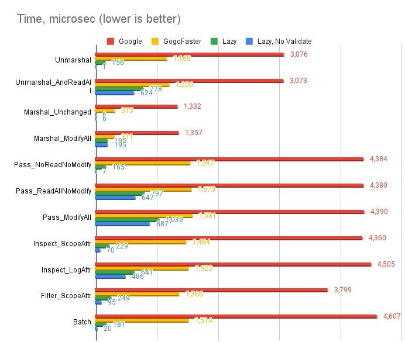

# LazyProto

This is an experimental implementation of Protobufs in Go that combines a few
interesting techniques to achieve significantly better performance than the official
Google [Go Protobuf library](https://pkg.go.dev/google.golang.org/protobuf) and better
than the [GoGo Protobuf library](https://github.com/gogo/protobuf).

Warning: not for production use. This is a research library.

## TLDR; Performance Comparison

Here is how this implementation compares to Google's
[Go Protobuf library](https://pkg.go.dev/google.golang.org/protobuf) and to 
[GoGo Protobuf library](https://github.com/gogo/protobuf).

Above we have a comparison between Google, GoGo and LazyProto implementations. LazyProto
is benchmarked twice: with and without unmarshalling validations (more on it later in
this document).

The bars show the time consumed when performing a specific benchmark. The benchmark
code can be found in [this file](internal/examples/simple/logs_test.go), here is a
rough explanation of each benchmark:

| Benchmark | Description                                           |
|--|------------------------------------------------------------------------------------------------------------------------------------------|
| Unmarshal | A call to Unmarshal() function that accepts a []byte slice and returns a message structure that allows the message fields to be accessed. |
| Unmarshal_AndReadAll | A call to Unmarshal(), followed by accessing every attribute of every message and embedded message. This forces LazyProto to decode every message, essentially negating any benefits of lazy decoding. |
